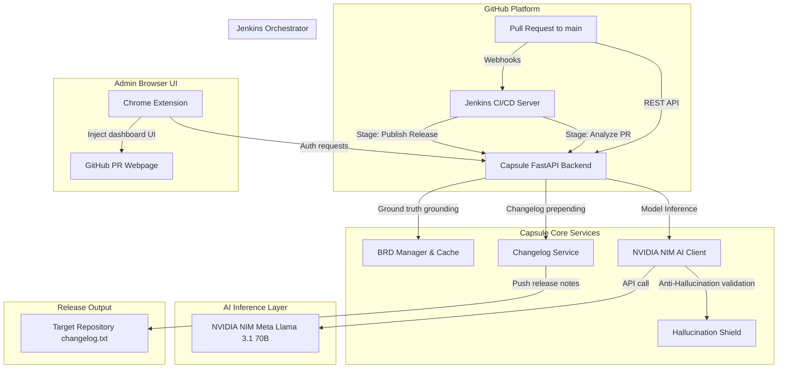

# Capsule 🛡️

[](https://www.python.org/)
[](https://fastapi.tiangolo.com/)
[](https://www.docker.com/)
[](LICENSE)

An intelligent, AI-powered CI/CD companion that analyzes GitHub Pull Requests against a Business Requirement Document (BRD), identifies workflow modifications, warns administrators of critical business rule deviations, and automatically creates release changelogs with Semantic Versioning (SemVer) increments.

---

## Architecture Overview



---

## Key Features

1. **AI-Driven Code Summarization**: Provides high-level and detailed change reports parsed from the unified pull request diff.
2. **Business Rule Grounding & Workflow Impact Check**: Compares codebase changes directly against the Business Requirement Document (BRD) to see if they violate, alter, or implement process flows.
3. **8-Layer Hallucination Shield**: Implements a strict anti-hallucination architecture, physical file validation checks, low temperature inference (`0.1`), and confidence scoring to ensure the AI never invents file details.
4. **SemVer Versioning & Automated Changelog**: Automatically increments version numbers (MAJOR for major workflow changes, MINOR for minor changes, PATCH for technical fixes) and prepends them to a remote `changelog.txt`.
5. **Shadow DOM Isolated Chrome Extension**: Injects a floating summary dashboard directly into GitHub Pull Request pages without affecting GitHub's stylesheets.
6. **Jenkins Pipeline Integration**: Fully-featured pipeline configuration to run summaries on code updates and execute releases upon PR merge.

---

## Tech Stack

| Component | Technology | Role |
|---|---|---|
| **Backend API** | FastAPI, Uvicorn | High-performance, async REST backend |
| **Database** | SQLite + Aiosqlite | Lightweight, asynchronous relational database |
| **AI LLM** | NVIDIA NIM (Meta Llama 3.1 70B) | Advanced code and requirements reasoning |
| **AI Client** | OpenAI SDK (AsyncOpenAI) | Interface wrapper for NVIDIA NIM endpoint |
| **Chrome Extension** | Javascript (Manifest V3) | Side-panel summary dashboard injected in GitHub |
| **CI/CD** | Jenkinsfile (Groovy) | Webhook trigger and deployment pipeline |
| **Containerization** | Docker, Docker-compose | Isolated runtime environment |

---

## Configuration Variables (`.env`)

Verify your environment configuration variables:

| Variable | Description | Default / Example |
|---|---|---|
| `API_KEY` | Secret token used to authenticate the Chrome extension | `capsule_secure_token_xyz` |
| `GITHUB_TOKEN` | Personal Access Token with repo commit access | `ghp_xxxxxxxxxxxx` |
| `GITHUB_WEBHOOK_SECRET` | Secret to check HMAC webhook signatures | `my_webhook_secret_phrase` |
| `CHANGELOG_REPO` | Target repo where `changelog.txt` is updated | `owner/repo-name` |
| `NVIDIA_NIM_API_KEY` | NVIDIA developer API credential | `nvapi-xxxxxxxxxxxx` |
| `NVIDIA_NIM_BASE_URL` | NVIDIA NIM endpoint URL | `https://integrate.api.nvidia.com/v1` |
| `NVIDIA_NIM_MODEL` | LLM model to query on NVIDIA NIM | `meta/llama-3.1-70b-instruct` |
| `DATABASE_URL` | SQLite path | `sqlite+aiosqlite:///./data/capsule.db` |
| `BRD_FILE_PATH` | Storage path of active requirements | `./brd/requirements.md` |

---

## Quick Start (Docker Compose)

The easiest way to start the Capsule API backend is using Docker:

1. Clone this repository to your host server:
   ```bash
   git clone https://github.com/PTejasKr/capsule.git
   cd capsule
   ```
2. Create a `.env` file from the example:
   ```bash
   cp .env.example .env
   ```
3. Edit the `.env` file and insert your API keys (`NVIDIA_NIM_API_KEY`, `GITHUB_TOKEN`, `CHANGELOG_REPO`, etc.).
4. Run the containers:
   ```bash
   docker-compose up -d --build
   ```
5. Check backend logs:
   ```bash
   docker-compose logs -f
   ```
6. Open your browser to `http://localhost:8000/api/health` to confirm it is running.

---

## Installing the Chrome Extension

1. Open Google Chrome.
2. Navigate to `chrome://extensions/`.
3. Enable **Developer mode** (toggle in the top-right corner).
4. Click **Load unpacked** in the top-left.
5. Select the `extension` folder inside this project's directory.
6. The extension is now loaded! Click the extension icon and select **Settings**.
7. Enter the backend URL (`http://localhost:8000`) and the API Key configured in your `.env`.
8. Open any GitHub Pull Request page to view the floating Capsule badge.

---

## CI/CD Pipeline Setup

Refer to [Jenkins Setup Guide](file:///c:/Users/punya/Desktop/capsule/jenkins/setup.md) for full instructions on setting up Jenkins credentials, installing Generic Webhook Trigger, and registering the GitHub Webhook.
